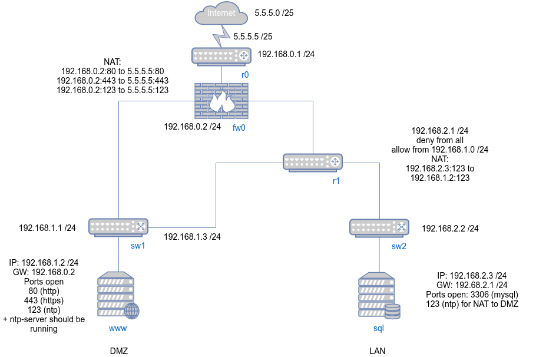

## №1 Сети

##### 1.
Сколько подсетей с маской `255.255.240.0` содержится в сети с маcкой `/8` ?

---

Маска исходной сети:  
`255.0.0.0 = /8` - 8 бит номер сети, 24 бита доступно для адресации.
Маска заданной подсети:
`255.255.240.0 = /20` - 20 бит отведено под номер сети, что полностью удовлетворяет свободным 24 битам исходной сети.
Последовательно поразрядно добавляем бит к маске основной сети до тех пор пока
не заполним маску для разбиения. В данном случае добавили 12 бит.
`Ksubnets = pow(2, n-k) = pow(2, 20-8) = pow(2,12) = 4096`
где `n` - длина маски заданной подсети, `k` - длина маски исходной сети.


---


##### 2.
Сколько подсетей с маской `255.240.255.0` содержится в сети с маской `255.0.0.0` ?

---

Ни одной. Сеть нельзя разбить на подсети с заданной маской, т.к она является заведомо невалидной имея
чередующиеся биты `0 -> 1` во 2-м октете.

---

##### 3.
Дано два сервера в разных подсетях. Необходимо описать `5` различных способов соединения данных серверов,
чтобы проходил `ping`, а также в каких случаях такие соединения приемлемы ?

---

1. Подключение через разные WAN-порты с разными внешними ip (например, разные ISP)
2. Подключение через L3-Switch и 2 x L2-Switch (пингуется только внутри сети)
3. Подключение через Router и 2 x L2-Switch
4. Подключение через NAT-Server(Router) по разным портам внутренней сети
5. Подключение через VPN-Server и туннель во внутреннюю сеть

---

##### 4.
Почему нельзя использовать `ping` для проверки доступности веб сервера ?

---

Поскольку `ping` работает на основе ICMP-протокола в сети есть вероятность быть подверженым ICMP-flood атакам.
Суть атаки состоит в отпраке больших пакетов данных при помощи утилиты `ping` на целевой адрес, что способствует
созданию дополнительного трафика(который может достигать величины пропускной способности) и увеличению нагрузки на устройство.
В целях безопасности ICMP-трафик фильтруется firewall или игнорируется. Поэтому ответ на `ping` можно
просто не получить.


---

##### 5.
Почему не рекомендуется использование самоподписанных SSL-сертификатов ?

---

Проблема self-signed сертификатов состоит в том, что нарушается так называемая цепочка доверия
(trust chain), в которой центр сертификации (CA) однозначно определяет подлинность ключа шифрования
и сервер которому данный сертификат был выдан.
Поэтому сервер с self-signed сертификатом может быть подвержен MITM-атаке из Internet, в которой злоумышленник
может подменить сертификат на свой собственный fake-вариант и похитить данные или скомпрометировать
источник.

---

##### 6.
Назначить серверу адрес `192.168.3.255`, показать вывод комманды `ifconfig`, после назначения адреса серверу

---
Необходимо выполнить команду с правами root:
```
# ifconfig enp0s8 inet 192.168.3.255 netmask 255.255.255.0
```

В результате получим:


В данном случае `enp0s8` - интерфейс виртуальной машины VirtualBox.
Если нужно сохранить настройку после перезагрузки нужно добавить конфиг
в `/etc/network/interfaces` или `/etc/netplan`.

---

##### 7.
Спроектировать сеть (нарисовать картинку с компонентами), с указанием портов, IP адресов и масок подсетей для каждого
узла сети, в которой установлен веб сервер доступный из интернета и SQL сервер к которому нет доступа из интернета,
но на котором должны синхронизироваться часы с серверами точного времени.

---



---
